# Image Processing

- [x]  Make a list of topics that I need to cover
- [x]  Select the technology that I will be using
- [x]  Make another list of topics for

# Image Processing

- Main Topics:
    1. Introduction to image processing
        1. The history of image processing 
        2. The future of image processing 
    2. Technologies/Libraries that I will be using
        1. Spyder: Scientific Python Development Environment IDE
        2. Python Technology
        3. OpenCV
    3. Understanding Digital Images Processing
        1. [link](https://www.youtube.com/watch?v=ag6x3OMKMb8&list=PLXOYj6DUOGrrjyRKpD0U0bIKGOXCAOHkE&index=3) - Image Processing fundamentals 
        2. [link](https://www.youtube.com/watch?v=Ijc-9L2iXEc&t=830s) - **Understanding digital images for Python processing**
    4. Color Models 
        1. RGB Color Model - [link](https://www.youtube.com/watch?v=XZwxyBblkJM&list=PLXOYj6DUOGrrjyRKpD0U0bIKGOXCAOHkE&index=32)
        2. Grayscale and black and white conversion 
    5. Camera Calibration and Image Undistortion
        1. [link](https://www.youtube.com/watch?v=H5qbRTikxI4) - **OpenCV Python Camera Calibration (Intrinsic, Extrinsic, Distortion)**
    6. The Histogram of image intensity
        1. [link](https://www.youtube.com/watch?v=kIVk0IhDMwY&list=PLZsOBAyNTZwYx-7GylDo3LSYpSompzsqW&index=8) - **Histogram based image segmentation in Python**
        2. [link](https://www.youtube.com/watch?v=jWShMEhMZI4&list=PLZsOBAyNTZwYx-7GylDo3LSYpSompzsqW&index=34) - **Histogram equalization and CLAHE**
    7. Geometrical Features of binary objects
        1. [link](https://www.youtube.com/watch?v=ZPQiKXqHYrM) - Geometric Properties | Binary Images
        2. [link](https://cse.usf.edu/~r1k/MachineVisionBook/MachineVision.files/MachineVision_Chapter2.pdf) - Binary Image Processing
    8. Binary objects labeling
        1. [link](https://datacarpentry.org/image-processing/08-connected-components.html) - How to extract separate objects from an image and describe these objects quantitatively.
        2. [link](https://medium.com/swlh/image-processing-with-python-connected-components-and-region-labeling-3eef1864b951) - Region labeling
    9. Border tracing Algorithm
        1. [link](https://www.youtube.com/watch?v=29bafUh5adg&t=2s) - **Moore's boundary tracing algorithm in python - Part-1**
    10. Morphological operation on binary images
        1. [link](https://docs.opencv.org/4.x/d9/d61/tutorial_py_morphological_ops.html) - **Morphological Transformations OpenCV**
        2. [link](https://saturncloud.io/blog/installing-opencv-with-conda-and-spyder-a-guide-for-data-scientists/) - How to get OpenCV
    11. Statistical properties of greyscale images
        1. [link](https://stackoverflow.com/questions/35586206/how-to-get-an-average-pixel-value-of-a-gray-scale-image-in-python-using-pil-nump) - [**How to Get an Average Pixel Value of a Gray Scale Image in Python Using PIL\Numpy?**](https://stackoverflow.com/questions/35586206/how-to-get-an-average-pixel-value-of-a-gray-scale-image-in-python-using-pil-nump)
    12. Image filtering and spatial and frequency domains
        1. [link](https://scikit-image.org/skimage-tutorials/lectures/1_image_filters.html) - Image Filtering with python
        2. [link](https://www.youtube.com/watch?v=DzVxMtnptqE) - Python Image filter
    13. Noise modeling and digital image filtering
        1. [link](https://stackoverflow.com/questions/62042172/how-to-remove-noise-in-image-opencv-python) - Noise removal - Gaussian noise
    14. Edge detection
        1. [link](https://www.geeksforgeeks.org/real-time-edge-detection-using-opencv-python/) - edge detection OpenCV
    15. Color image processing
        1. [link](https://www.youtube.com/watch?v=4hPl7GMnz5I&list=PLZsOBAyNTZwYx-7GylDo3LSYpSompzsqW&index=142) - Image segmentation using color space

# Color Image Processing

- [ ]  Main Topics:
    - [x]  **Introduction to image processing**
        1. **Objectives**: Main goals of this thesis.
        2. **Scope**: Outline the boundaries of your study.
    - [x]  **Intro/Motivation**
        1. The history of image processing 
        2. Practical applications of color image processing
        3. The future of image processing 
    - [ ]  **Color Models -** [https://dl.icdst.org/pdfs/files4/01c56e081202b62bd7d3b4f8545775fb.pdf](https://dl.icdst.org/pdfs/files4/01c56e081202b62bd7d3b4f8545775fb.pdf)
        1. RGB, HSV, CMYK, YUV
    - [x]  **Color Image Representation**: Describe how color images are represented in digital form.
        1. [link](https://www.youtube.com/watch?v=Ijc-9L2iXEc&t=830s) - **Understanding digital images for Python processing**
        2. **Color Space Transformations**: Explain transformations between different color spaces and their purposes.
            1. Use formulas from “Ngjyrat” document
            2. Transformations between different color spaces
            3. Benefits and usages of each color space
    - [x]  **Image Segmentation / Color Segmentation**: Describe methods for segmenting color images.
        - [link](https://www.youtube.com/watch?v=kIVk0IhDMwY&list=PLZsOBAyNTZwYx-7GylDo3LSYpSompzsqW&index=8) - **Histogram based image segmentation in Python**
        - U-net Segmentation [https://www.youtube.com/watch?v=csFGTLT6_WQ&list=PLZsOBAyNTZwbR08R959iCvYT3qzhxvGOE&index=9](https://www.youtube.com/watch?v=csFGTLT6_WQ&list=PLZsOBAyNTZwbR08R959iCvYT3qzhxvGOE&index=9)
    - [x]  **Color Edge detections**
        1. [link](https://www.geeksforgeeks.org/real-time-edge-detection-using-opencv-python/) - edge detection OpenCV
    - [x]  **Object Recognition**: Explain approaches for recognizing objects in color images.
        1. [link](https://www.youtube.com/watch?v=P5FTEryiTl4&list=PLZsOBAyNTZwYx-7GylDo3LSYpSompzsqW&index=45) - object detection - https://docs.opencv.org/4.x/d4/dc6/tutorial_py_template_matching.html
        2. [https://docs.opencv.org/3.4/de/da9/tutorial_template_matching.html#:~:text=Template matching is a technique,used to find the match](https://docs.opencv.org/3.4/de/da9/tutorial_template_matching.html#:~:text=Template%20matching%20is%20a%20technique,used%20to%20find%20the%20match).
        3. https://docs.fab-image.com/5.0/fil/machine_vision_guide/TemplateMatching.html
        4. 
    - [ ]  **Feature Extraction**: Discuss techniques for extracting features from color images.
        - [link](https://www.youtube.com/watch?v=zN9ZINn7g24&list=PLZsOBAyNTZwYx-7GylDo3LSYpSompzsqW&index=175) -  **Content based image retrieval via feature extraction in python**
    - [ ]  **Restoration**
    - [ ]  **Image Enhancement:**
        1. ~~Contrast Enhancement~~
        2. ~~Noise Reduction~~
        3. ~~Edge Enhancement aka Sharpness~~
    - [ ]  Image Compression
        - [ ]  Compression methods and types
        - [ ]  Implement on of them - JPEG
            - [ ]  **Encoding**
    - [ ]  Implementation of the above topics in code:
        - **Tools and Libraries**: List the Python libraries” OpenCV, PIL, scikit-image).
        - **Algorithm Implementation**:
            - Based on the above topics…
        - Code examples and result screenshots for all above topics
        

## Objectives

The primary goals of this thesis on *Color Image Processing* are as follows:

1. **Explore Color Models:**
    - Provide an in-depth understanding of various color models including RGB, HSV, CMYK, and YUV.
    - Discuss the mathematical representation and practical significance of these models in image processing.
2. **Understand Color Image Representation:**
    - Explain how digital systems represent color images, including bit-depth, pixel arrangements, and encoding techniques.
    - Introduce transformations between different color spaces and their practical applications, supported by mathematical formulas and examples.
3. **Investigate Image Segmentation Techniques:**
    - Examine methods for segmenting color images, such as histogram-based and advanced machine learning techniques like U-Net.
    - Highlight the importance of segmentation in applications like object detection and feature extraction.
4. **Analyze Color Edge Detection Methods:**
    - Study techniques for detecting edges in color images to enhance feature extraction and shape recognition.
5. **Delve into Feature Extraction and Object Recognition:**
    - Present methods to extract meaningful features from color images and use them for object recognition.
    - Explore real-world applications such as content-based image retrieval.
6. **Enhance Image Quality:**
    - Discuss various enhancement techniques, including sharpening, bluring, edge detection.
7. **Image Restoration:**
    - Explore methods to restore degraded images, focusing on techniques for deblurring, noise removal, and reconstructing missing or corrupted parts of images.
8. **Image Encoding:**
    - Analyze techniques for encoding color images for efficient storage and transmission.
    - Discuss modern encoding standards and their applications.
9. **Implement Theoretical Concepts Through Coding:**
    - Use Python libraries like OpenCV, PIL, and scikit-image to implement the above concepts.
    - Provide code examples, explanations, and visual results.

## Scope

This thesis focuses on the computational aspects of color image processing. The scope is defined as follows:

1. **Core Topics:**
    - Examination of foundational and advanced topics in color image processing, such as color models, image segmentation, and feature extraction.
    - Implementation of image enhancement techniques to demonstrate their practical utility.
2. **Tools and Technologies:**
    - Usage of Python and its libraries for coding and experimentation.
    - Integration of mathematical transformations and algorithms for analyzing and processing color images.
3. **Applications:**
    - Emphasis on practical applications in fields like computer vision, content-based image retrieval, and real-time object detection.
4. **Boundaries:**
    - The study excludes hardware-specific implementations, focusing solely on software and algorithmic approaches.
    - The scope does not cover topics like video processing or 3D image processing, although these are tangentially related.

Through this thesis, the aim is to provide a comprehensive understanding of color image processing, from theoretical principles to practical applications, with a strong emphasis on implementation and experimentation.

## Short History in Image Processing

https://ijarcce.com/wp-content/uploads/2022/06/IJARCCE.2022.11672.pdf

Many of the techniques of digital image processing, or digital picture processing as it often was called, were developed in the 1960s, at Bell Laboratories, the Jet Propulsion Laboratory, Massachusetts Institute of Technology, University of Maryland, and a few other research facilities. These techniques were initially applied to satellite imagery, wire-photo standards conversion, medical imaging, videophone, character recognition, and photograph enhancement. The purpose of early image processing was to improve the quality of the image, primarily for human interpretation. Typical tasks included image enhancement, restoration, encoding, and compression.

The first significant application of digital image processing was carried out by the American Jet Propulsion Laboratory (JPL). In 1964, JPL used image processing techniques such as geometric correction, gradation transformation, and noise removal on thousands of lunar photos sent back by the Space Detector Ranger 7. By considering the position of the Sun and the environment of the Moon, JPL successfully mapped the Moon’s surface, paving the way for future lunar exploration. Later, more advanced processing of nearly 100,000 photos produced detailed topographic maps, color maps, and panoramic mosaics of the Moon, which achieved groundbreaking results and supported human landing missions.

In the 1970s, advancements in computing technology made digital image processing more accessible as cheaper computers and dedicated hardware became available. This enabled real-time processing for specific tasks like television standards conversion. By the 2000s, with the advent of fast computers and signal processors, digital image processing became the dominant form of image manipulation, favored for its versatility and cost-effectiveness.

## **Color Image Representation**: Describe how color images are represented in digital form.

### Digital Image

An Digital Image is nothing but an array of numbers, and each pixel is just a number. For colored images, the values per pixel are Red Green and Blue.

In python there is one more value that is used to give value to a pixel, which is called alpha, it defines the transparency of the pixel.

Colors are usually defined in RGB. We also have HSL which stand for Hue Saturation Luminosity. These are two different color spaces that can represent a color of an pixel. In the Paint Tool we can see the below example on how the color Yellow is represent on both color spaces.

Each color spaces have their own pros and cons, but for our brain is easier to imagine the values of the RGB then the ones of HSL because it comes more natural to us to combine the values of the RGB. For that reason we commonly use this color space when working with Image Processing.

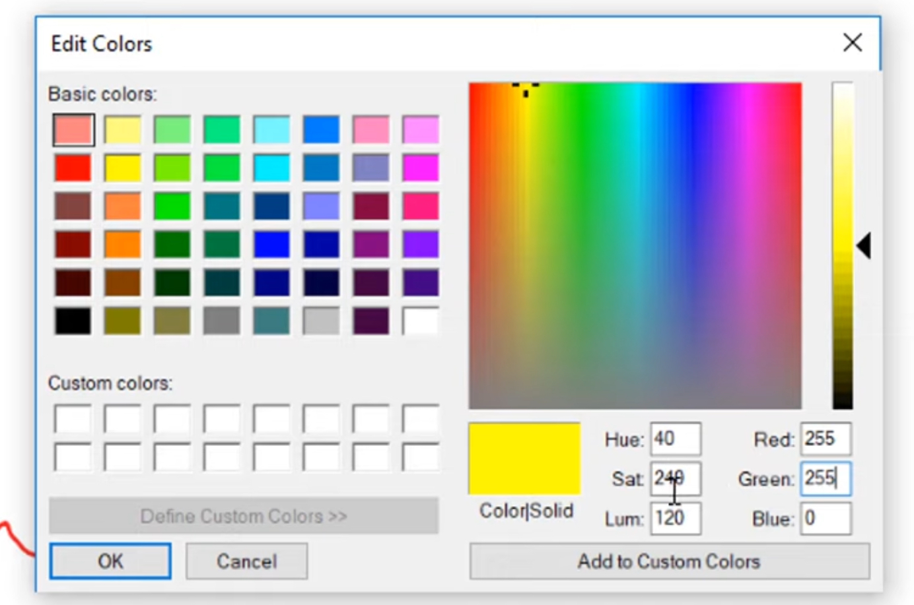

Fig 1. Paint Tool Edit color mode, showing how Yellow color is represent in both color spaces, RGB and HSL.

### Processing the Image

Dependencies for Windows PC:

1. Spyder IDE
2. Python
3. Miniconda
4. Scikit-image Library

Commands to run:

```jsx
conda install scikit-image
```

To see concretely the values of these pixels that we see in the screen, we can test it with the below script.   

```python
from skimage import io

import matplotlib.pyplot as plt

#Below path is specific to my computer
images_folder_path = "C:/Users/STORM/Desktop/images/" 

cells_image = io.imread(images_folder_path + "images_of_cells.jpg")
print(cells_image)
print('---')
print(cells_image[0][0])
print('---')

print(cells_image.min(), cells_image.max())
print('---')

plt.imshow(cells_image)
```

The first pixel is the first value pair on the console log output. It has the value [196, 169, 174], which value represents the color in the RGB format. What can be also deducted form the log and the Variables Explorer is the below:

1. The image Format is unit8 which stands for unsigned integer 8bit
2. The 8bit means that 256 is the maximum value of the one of the 3 values within the array, where 0 is minimum value and 255 is maximum value
3. The size of the image is 331 by 504 pixels and 3 stands for Red Green Blue channels.
4. The value of the first pixel in the position 0 0 is [196, 169, 174]


Fig 2. An Image of humans cells

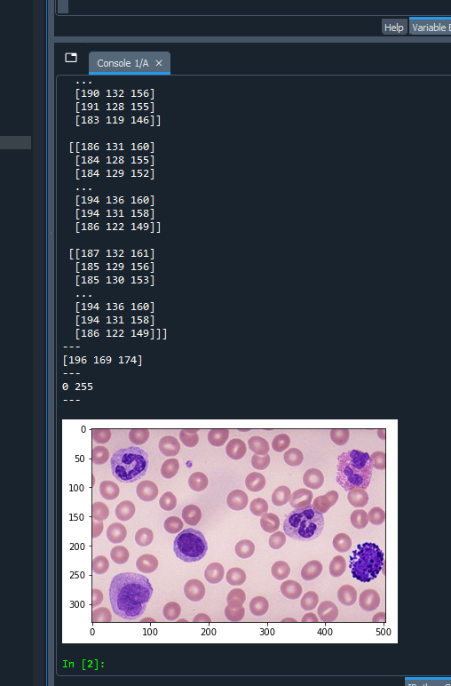

Fig 4. Array Output, first pixel value, minimum and maximum values, the image output

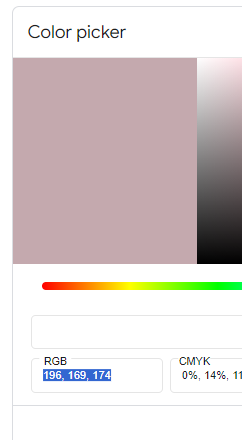

Fig 5. The color in RGB of the first pixel on the humans cells image

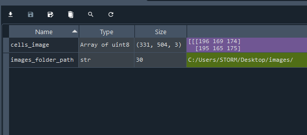

Fig 5. Variable Explorer section and cells image data

![Fig 2. Console Log the humans cells image, where the first value of the first pixel is [196, 169, 174]](Untitled%201.png)

Fig 2. Console Log the humans cells image, where the first value of the first pixel is [196, 169, 174]


Editing the pixels within the image can be done for example with the below command:

```python
from skimage import io

import matplotlib.pyplot as plt

#Below path is specific to my computer
images_folder_path = "C:/Users/STORM/Desktop/images/" 

cells_image = io.imread(images_folder_path + "images_of_cells.jpg")

cells_image[50:300, 10:200, :] = [0, 255, 0]
plt.imshow(cells_image)

plt.imshow(cells_image)
```

### Reading Images in different libraries

```python
####################################### Imports >

from skimage import io
import haas np

#ploting library #pyplot to create 2d plots and graphs #similar as matlab
import matplotlib.pyplot as plt 
import matplotlib.image as mpimg
 
#pillow - The Python Imaging Library adds image processing capabilities to your Python interpreter.
from PIL import Image

#image processing library, image segemntation, feature detection, a lot other stuff
from skimage import io #read images, shows the same as matplot 

#open_cv is a library of programming functions used to manipulate matrices(images videos)
import cv2 as cv

#glop is used for looping into files within a folder
**import glob**

####################################### < Imports 

####################################### File >

images_folder_path = "C:/Users/STORM/Desktop/images/"
cells_image_path = images_folder_path + "images_of_cells.jpg"

####################################### < File 

#skimage lib - reading image file
cells_image = io.imread(cells_image_path)
print(type(cells_image)) #<class 'numpy.ndarray'>
#print(cells_image.format) AttributeError:'numpy.ndarray' object has no attribute 'format'

img = Image.open(cells_image_path);
print(type(img)) #<class 'PIL.JpegImagePlugin.JpegImageFile'>
print(img.format) #JPEG

img.show() #opens new image tab

#convert Pil Image into a numpy array
numpy_image = np.asarray(img);
print(type(numpy_image)) #<class 'numpy.ndarray'>

#convert image to matplot
matplot_image = mpimg.imread(cells_image_path)
print(type(matplot_image)) #<class 'numpy.ndarray'>
print(matplot_image.shape) #(331, 504, 3)
#plt.imshow(matplot_image) #shows scales on the logs
plt.colorbar() 

#scikit-image
image_ski = io.imread(cells_image_path)
print(type(image_ski)) #<class 'numpy.ndarray'>

#can be used for converting
#from skimage import img_as_float, img_as_ubyte
# img_float = img_as_float(image_ski)
# img_float = io.imread("...").astype(np.float) doest work correctly, exp 92 -> 92.0

image_cv_grey = cv.imread(cells_image_path, 0);
image_cv = cv.imread(cells_image_path, 1);

print(type(image_cv)) #<class 'numpy.ndarray'>

#By default it import images as BRG and not RGB that's why display cv image with plt looks different
plt.imshow(cv.cvtColor(image_cv, cv.COLOR_BGR2RGB))# change color space
#plt.imshow(image_cv) #shows with different colors

cv.imshow("Grey Image", image_cv_grey);
cv.imshow("Colored Image", image_cv);

cv.waitKey(0)
cv.destroyAllWindows()

#czifile, for microscope images
#OME-TIFF type

# looping into 1 folder 
**path = images_folder_path + "*"
for file in glob.glob(path):
    print(file)**
```

On the Imports section there are many imported libraries that have their own usages, methods, functions and will be used on this script to showcase how to read the images and displaying them using different libraries.

`scikit-image` Library:

Is a Python library used for image processing. It is part of the broader `scikit-learn` ecosystem, but specifically tailored for image data. The library provides a wide range of algorithms and utilities to perform tasks such as: `Image Filtering`, `Segmentation`, `Feature Detection`, etc.

`matplotlib` Library:
`matplotlib` is a popular Python library used for creating static, interactive, and animated visualizations in a wide variety of formats. It is particularly useful for generating plots, charts, and graphs in Python to perform tasks such as: `2D Plotting`, `3D Plotting`, `Subplots and Complex Layouts`, etc. 

`Pillow` Library:

Is a popular Python library used for image processing. It is essentially a fork of the original Python Imaging Library (PIL), which is no longer maintained. `Pillow` provides a wide range of functionalities for working with images, including loading, manipulating, and saving images in various formats. Here are the key uses of the `Pillow` library: `Image Manipulation`, `Image Enhancement`, `Image Transformations`, etc.

`OpenCV` (Open Source Computer Vision Library):

Is a powerful and widely-used library for computer vision, image processing, and machine learning tasks. It is written in C++ and has Python bindings, making it accessible to Python developers. `OpenCV` is designed for real-time applications and provides a comprehensive suite of tools for working with images and videos. Here are the key uses and capabilities of the `OpenCV` library: `Feature Matching`, `Deep Learning Models`, `Image Segmentation`, etc.

`NumPy` (Numerical Python) 
Is a fundamental library in Python used for numerical and scientific computing. It provides support for large, multi-dimensional arrays and matrices, along with a collection of mathematical functions to operate on these arrays. Here are the key uses and capabilities of the `NumPy` library: `File I/O`, `Array Creation and Manipulation`, `Mathematical Functions`, etc.

Key take away from this code are:

1. Each library is used for specific reasons, but all of them have the same method that can be used for reading a file image `imread()`
2. We can check the type of image using the command `type(img_variable)`, most of the libraries used `numpy.ndarray` except the `pillow` library that uses `PIL.JpegImagePlugin.JpegImageFile` type. 
3. When using the Open CV library to process an image, it will by default import images as BRG and not RGB that's why display cv image with `plt` looks different. That’s because the Red and Blue are swapped. 
4. This command `cv.cvtColor(image_cv, cv.COLOR_BGR2RGB)` is used to convert the color space from BGR to RGB.


Fig 7. Examples of the code section where it can be seen how to open up an image using open-cv library and how it has a different color space from the matplotlib library.

---

## **Image Segmentation**

A group of pixels of an image that are separated or selected as a group, also can be called segments. And the process of extracting these segments from an image is called Image Segmentation. Image segmentation can be done in a lot of forms and techniques but one of the simplest ones is segmentation using Histogram(which is covered on the below code). Histogram based segmentation falls under the thresholding techniques segmentations, which means that the segmentation of the pixels is based of the similarities of the pixel intensity values.

### Histogram and Thresholding Technique

```python
from skimage import io, color
import numpy as np
from matplotlib import pyplot as plt

images_folder_path = "C:/Users/STORM/Desktop/images/"
cells_image_path = images_folder_path + "images_of_cells.jpg"

img = io.imread(cells_image_path)
img_gray = color.rgb2gray(img)
io.imshow(img_gray)

# Plot the histogram
plt.figure()
plt.hist(img_gray.ravel(), bins=256, range=(0.1, 0.9), fc='black', ec='black')
plt.title('Histogram of Grayscale Image')
plt.xlabel('Pixel Intensity')
plt.ylabel('Frequency')
plt.show()

seg0 = (img_gray <= 0.1)
seg1 = (img_gray > 0.1) & (img_gray < 0.4)
seg2 = (img_gray >= 0.4)

print(img_gray.shape[1])

all_segments = np.zeros((img_gray.shape[0], img_gray.shape[1], 3))

all_segments[seg0] = (0, 0, 0)
all_segments[seg1] = (0, 1, 0)
all_segments[seg2] = (0, 0, 0)

io.imshow(all_segments)

```

There are different Segmentation Techniques like:

1. Thresholding Techniques
2. Edge-Based Segmentation
3. Region-Based Segmentation
4. Clustering-Based Segmentation
5. Model-Based Segmentation
6. Machine Learning-Based Segmentation
7. Hybrid Techniques
8. Graph-Based Segmentation

For this we have used `img_as_float`,  `io` and `color` from Skiti Libary, Numpy Librart and MatPlot. 

The image first is being converted from a RGB Color Space to a Grey Image. The MatPlot Lib provides us with the method `hist()` where it takes the image and generates the image histogram.

`img_gray.ravel()` flattens the 2D grayscale image into a 1D array, which is required for `plt.hist()`. `bins=256` specifies the number of bins for the histogram, the more bins the more details we see on the histogram. Since the image is grayscale, the intensity values range from 0 to 1, and 256 bins will give a detailed distribution. `range=(0.0, 1.0)` sets the range of pixel intensities for the histogram.

Based on the Histogram we see that the values with the least Pixel Intensity are very infrequently spread. The darker parts on the image are mostly focused on the pixel intensity 0.1 to 0.4 from which we filter them by intensity values and divide them into a segment `(img_gray > 0.1) & (img_gray < 0.4)`.

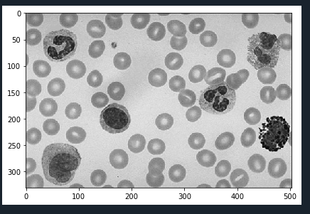

Grey Converted Image the Cells 

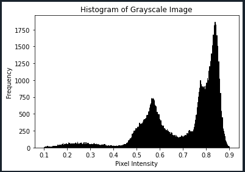

Histogram for the Grey Scaled Cells Image

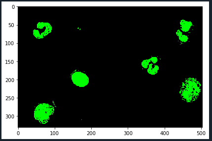

Image Segmentation based on Pixel Intesity 

### Color Segmentation in HSV Color Space

What is HSV and how do be divide by color value

```python
from skimage import io, measure
import numpy as np
from matplotlib import pyplot as plt
import cv2 as cv

images_folder_path = "C:/Users/STORM/Desktop/images/"
cells_image_path = images_folder_path + "images_of_cells.jpg"

img = io.imread(cells_image_path)
plt.imshow(img)

hsv = cv.cvtColor(img, cv.COLOR_RGB2HSV)
maskCellOne = cv.inRange(hsv, (120,90,90), (140,255,255))
maskCellTwo = cv.inRange(hsv, (150,60,60), (170,255,255))

labled_cells_image_one = measure.label(maskCellOne);
labled_cells_image_two = measure.label(maskCellTwo);

from skimage.color import label2rgb
image_one_overlay = label2rgb(labled_cells_image_one, image=img)
image_two_overlay = label2rgb(labled_cells_image_two)

io.imshow(image_one_overlay)
```

What does this code do?


HSV Color Space OpenCV Values Cells Images

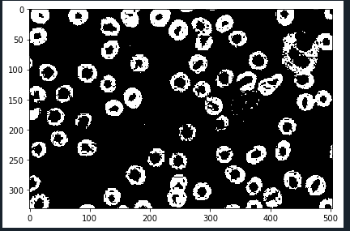

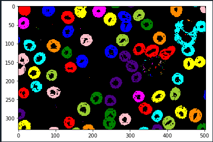

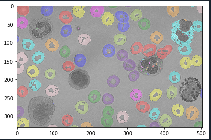

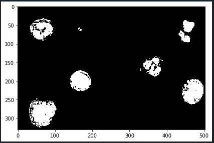

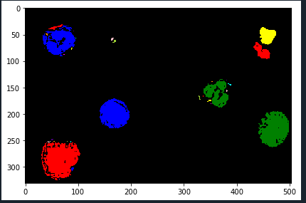

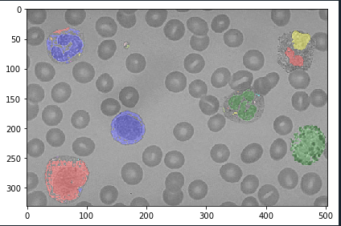

---

## Edge Detection and Filters

### Roberts Edge Filter

```python
import cv2
import numpy as np
import matplotlib.pyplot as plt
from skimage import io

# Read the input image
images_folder_path = "C:/Users/STORM/Desktop/images/"
cells_image_path = images_folder_path + "images_of_cells.jpg"

img = io.imread(cells_image_path)

# Convert the truecolor RGB image to grayscale
gray_image = cv2.cvtColor(img, cv2.COLOR_BGR2GRAY)

# Convert the image to double (floating-point type)
gray_image = gray_image.astype(float)

# Roberts operator masks
Mx = np.array([[1, 0], [0, -1]])
My = np.array([[0, 1], [-1, 0]])

# Pre-allocate the filtered_image matrix with zeros
filtered_image = np.zeros_like(gray_image)

# Edge detection process
for i in range(gray_image.shape[0] - 1):
    for j in range(gray_image.shape[1] - 1):
        Gx = np.sum(Mx * gray_image[i:i+2, j:j+2])
        Gy = np.sum(My * gray_image[i:i+2, j:j+2])
        filtered_image[i, j] = np.sqrt(Gx**2 + Gy**2)

# Convert the filtered image to uint8 type
filtered_image = np.uint8(filtered_image)

# Display the filtered image
plt.figure(figsize=(10, 10))
plt.imshow(filtered_image, cmap='gray')
plt.title('Filtered Image')
plt.show()

# Define a threshold value
threshold_value = 30

# Apply thresholding to get the output image
output_image = np.maximum(filtered_image, threshold_value)
output_image[output_image == threshold_value] = 0

# Convert the output image to binary (black and white)
_, output_image = cv2.threshold(output_image, 1, 255, cv2.THRESH_BINARY)

# Display the output image
plt.figure(figsize=(10, 10))
plt.imshow(output_image, cmap='gray')
plt.title('Edge Detected Image')
plt.show()

```

### One of the first edge detectors, cross gradient operator

cross diagonal differences

3by3 neighbor

Issues:

the neighbor edges vertical or vertical are not checked

Its a larger number of calculations since it checks every cross diagonal

$$
√ Mx² + My² 
$$

Improved:

masks bigger and more neighbor pixels calculated

Masks used for different operators:

Sobel - more emphasis closers to the center of the mask

Prewitt - Horizontal and vertical 

The Roberts Cross operator performs a simple, quick to compute, 2-D spatial gradient measurement on an image. It thus highlights regions of [high spatial frequency](https://homepages.inf.ed.ac.uk/rbf/HIPR2/freqdom.htm) which often correspond to edges. In its most common usage, the input to the operator is a grayscale image, as is the output. Pixel values at each point in the output represent the estimated absolute magnitude of the spatial gradient of the input image at that point.

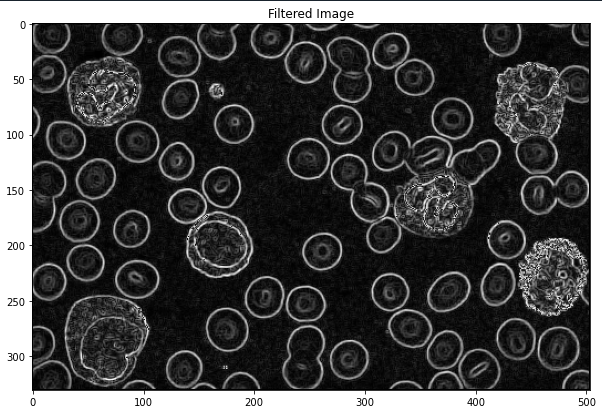

$$
Mx = [-1, 0; 0, 1]; My = [0, -1; 1, 0];   
$$

```python
# Roberts operator masks
Mx = np.array([[1, 0], [0, -1]])
My = np.array([[0, 1], [-1, 0]])

# Pre-allocate the filtered_image matrix with zeros
filtered_image = np.zeros_like(gray_image)

# Edge detection process
for i in range(gray_image.shape[0] - 1):
    for j in range(gray_image.shape[1] - 1):
        Gx = np.sum(Mx * gray_image[i:i+2, j:j+2])
        Gy = np.sum(My * gray_image[i:i+2, j:j+2])
        filtered_image[i, j] = np.sqrt(Gx**2 + Gy**2)

```

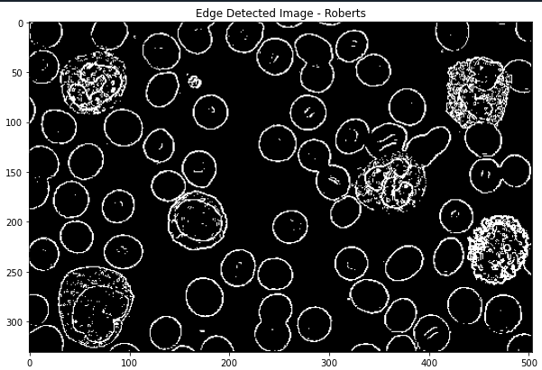

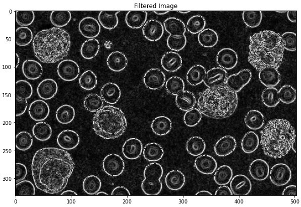

$$
Mx = [-1, -2, -1; 0, 0, 0; 1, 2,1]; 
My = [-1, 0, 1; -2, 0, 2; -1, 0, 1]; 
$$

```python
# Sobel operator masks
Mx = np.array([[-1, -2, -1], 
               [ 0,  0,  0], 
               [ 1,  2,  1]])

My = np.array([[-1,  0,  1], 
               [-2,  0,  2], 
               [-1,  0,  1]])

# Pre-allocate the filtered_image matrix with zeros
filtered_image = np.zeros_like(gray_image)

# Edge detection process
for i in range(1, gray_image.shape[0] - 1):
    for j in range(1, gray_image.shape[1] - 1):
        Gx = np.sum(Mx * gray_image[i-1:i+2, j-1:j+2])
        Gy = np.sum(My * gray_image[i-1:i+2, j-1:j+2])
        filtered_image[i, j] = np.sqrt(Gx**2 + Gy**2)
```

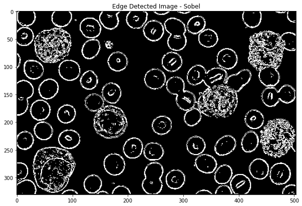

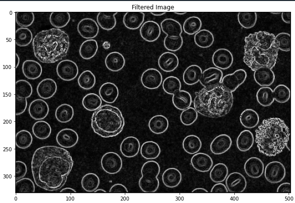

$$
Mx = [-1, -1, -1; 0, 0, 0; 1, 1, 1]; 
My = [-1, 0, 1; -1, 0, 1; -1, 0, 1]; 
$$

```python
# Perwitt operator masks
Mx = np.array([[-1, -1, -1], 
               [ 0,  0,  0], 
               [ 1,  1,  1]])

My = np.array([[-1,  0,  1], 
               [-1,  0,  1], 
               [-1,  0,  1]])

# Pre-allocate the filtered_image matrix with zeros
filtered_image = np.zeros_like(gray_image)
```

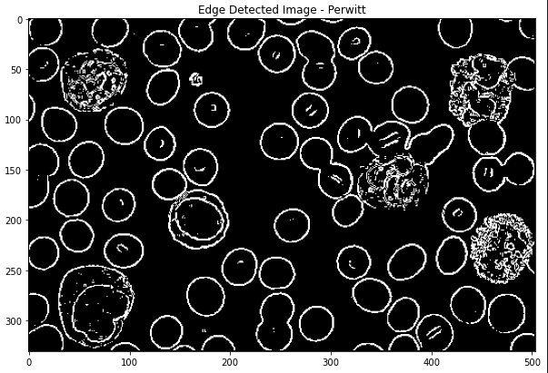

---

### Gaussian Filter

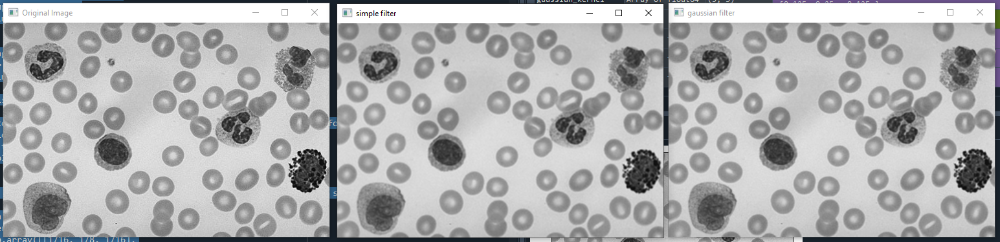

```python
import cv2
import numpy as np
import matplotlib.pyplot as plt
from skimage import io, img_as_float, color
from scipy.signal import convolve2d
from scipy.ndimage import convolve

# Read the input image
images_folder_path = "C:/Users/STORM/Desktop/images/"
cells_image_path = images_folder_path + "images_of_cells.jpg"

img = io.imread(cells_image_path)

#Best to turn it into float to keep the image intact, since unit8 can loose some information
img = img_as_float(io.imread(cells_image_path))
# Convert the image to grayscale
img_gray = color.rgb2gray(img)
io.imshow(img_gray)

kernel = np.ones((3, 3), np.float32)/9 #25 bc 5 by of ones, and 25 of them make 1.0 so it's normalized

#normalized Gaussian Kernel 
#pagging, stride, kernel, all equal one, convolution
gaussian_kernel = np.array([[1/16, 1/8, 1/16],
                            [1/8, 1/4, 1/8],
                            [1/16, 1/8, 1/16]])

#what the -1 depth?/ REPLICATE
conv_gaussian = cv2.filter2D(img_gray, -1, gaussian_kernel, borderType=cv2.BORDER_REPLICATE);
conv_kernel = cv2.filter2D(img_gray, -1, kernel, borderType=cv2.BORDER_REPLICATE);

cv2.imshow('Original Image', img_gray)
cv2.imshow('simple filter', conv_kernel)
cv2.imshow('gaussian filter', conv_gaussian)

cv2.waitKey(0)
cv2.destroyAllWindows()
```

Gaussian Denoising Filter - Blur in Photoshop

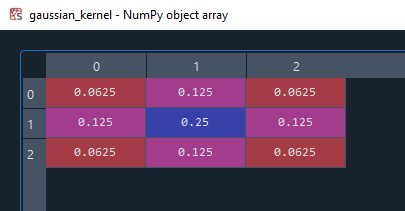

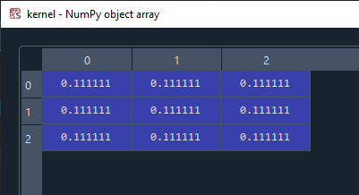

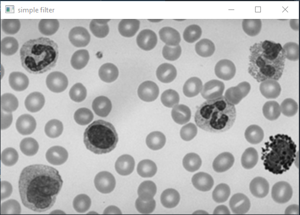

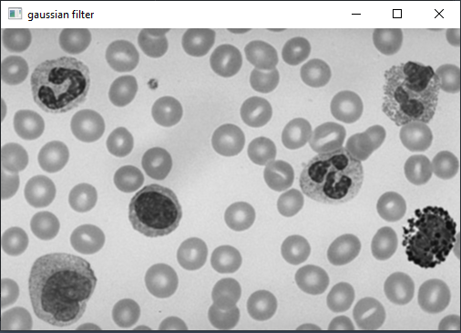

### Canny Edge detection

```python
import cv2 as cv
import matplotlib.pyplot as plt
import numpy as np
import os
from skimage import io

# Read the input image
images_folder_path = "C:/Users/STORM/Desktop/images/"
cells_image_path = images_folder_path + "images_of_cells.jpg"

def callback(input):
    pass

def cannyEdgeDetection():
    img = cv.imread(cells_image_path, 0)
    
    windowName = 'Canny Edge Detection'
    cv.namedWindow(windowName)
    cv.createTrackbar('minTreshhold', windowName, 0, 255, callback)
    cv.createTrackbar('maxTreshhold', windowName, 0, 255, callback)
    
    while True:
        if cv.waitKey(1) == ord('q'):
            break
        
        minThresh = cv.getTrackbarPos('minTreshhold', windowName)
        maxThresh = cv.getTrackbarPos('maxTreshhold', windowName)
        cannyEdge = cv.Canny(img, minThresh, maxThresh)
        cv.imshow(windowName, cannyEdge)
        
    cv.destroyAllWindows()

if __name__ == '__main__':
    cannyEdgeDetection()
    
```

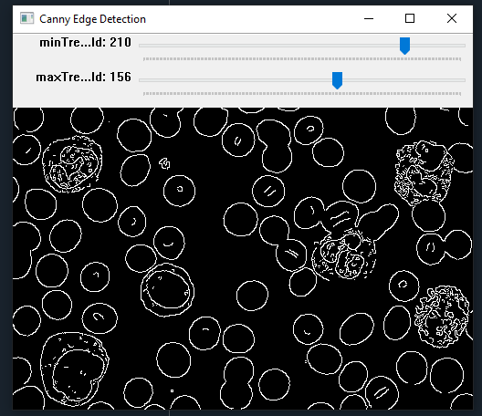

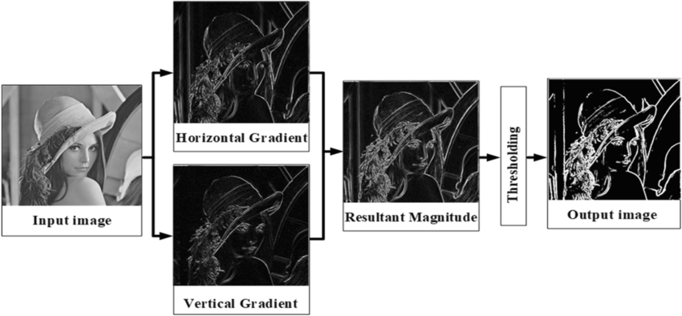

## Equalization Histogram

**Equalization Histogram** is a technique used in image processing to enhance the contrast of an image. It works by redistributing the intensity values in an image so that the histogram becomes flat. This means that the image will have a wider range of intensity values, making it easier to see details.

- **Calculate the Histogram:**
    - The function first divides the intensity range of the image (typically 0-255 for 8-bit images) into bins.
    - It then counts the number of pixels that fall into each bin to create a histogram.
- **Compute the Cumulative Distribution Function (CDF):**
    - The CDF is calculated by iteratively summing the histogram values. It represents the cumulative probability of a pixel's intensity being less than or equal to a given value.
- **Normalize the CDF:**
    - The CDF is normalized by dividing each value by the total number of pixels in the image. This scales the CDF to the range [0, 1].
- **Map Intensities:**
    - For each pixel in the image, its intensity value is mapped to a new intensity value based on the normalized CDF.
    - The mapping is done by multiplying the normalized CDF value by 255 (or the maximum intensity value for other image depths).
    
    https://docs.opencv.org/4.x/d5/daf/tutorial_py_histogram_equalization.html
    
    [https://docs.opencv.org/4.x/d6/dc7/group__imgproc__hist.html#ga4b2b5fd75503ff9e6844cc4dcdaed35d](https://docs.opencv.org/4.x/d6/dc7/group__imgproc__hist.html#ga4b2b5fd75503ff9e6844cc4dcdaed35d)
    
    [https://github.com/bnsreenu/python_for_microscopists/blob/108421a78eb7557c2844f8bd9c5290ddb0bf80d9/113-what_is_histogram_equalization.py#L36](https://github.com/bnsreenu/python_for_microscopists/blob/108421a78eb7557c2844f8bd9c5290ddb0bf80d9/113-what_is_histogram_equalization.py#L36)
    
    https://www.codeproject.com/Tips/870557/How-To-Make-A-Clear-Color-Image-Histogram-Equaliza
    
    https://stackoverflow.com/questions/74326873/histogram-equalization-on-a-color-image
    
    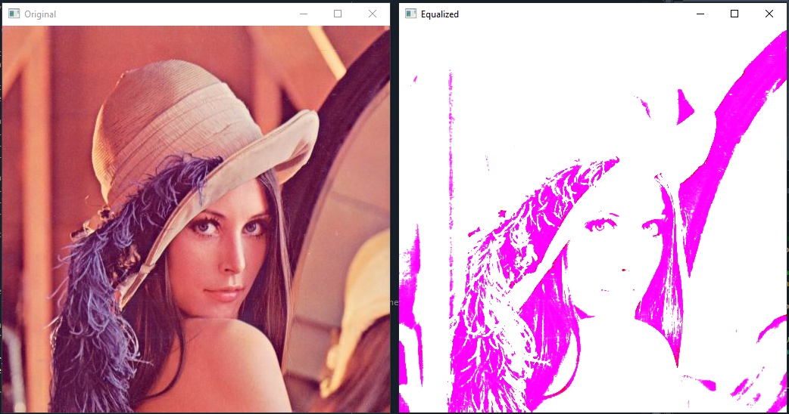
    
    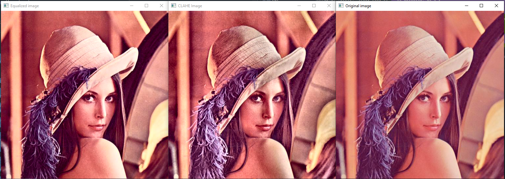
    
    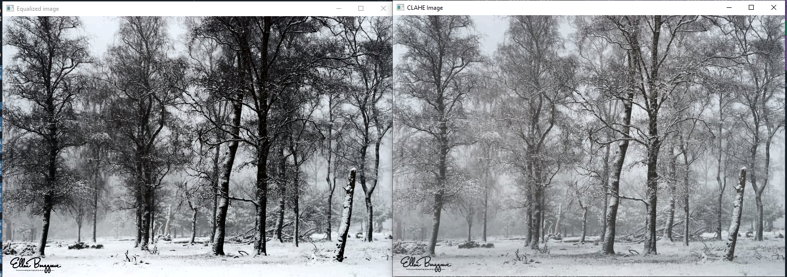
    

```python
import cv2

# Read the image
img = cv2.imread('image.jpg')

# Equalize the histogram
equ = cv2.equalizeHist(img)

# Show the original and equalized images
cv2.imshow('Original', img)
cv2.imshow('Equalized', equ)
cv2.waitKey(0)
cv2.destroyAllWindows()

////
import cv2
import numpy as np

images_folder_path = "C:/Users/STORM/Desktop/images/"
image = images_folder_path + "image_hist_equal.png"

import cv2
import numpy as np

def equalize_hist(img):
    # Get the image histogram
    hist = cv2.calcHist([img], [0], None, [256], [0, 256])

    # Calculate the cumulative distribution function (CDF)
    cdf = np.cumsum(hist)

    # Normalize the CDF
    cdf_normalized = cdf * 255 / cdf[-1]

    # Map intensities using the normalized CDF
    result = np.interp(img.flatten(), np.arange(256), cdf_normalized)

    return result.reshape(img.shape)

# Example usage
img = cv2.imread(image)
equ = equalize_hist(img)

cv2.imshow('Original', img)
cv2.imshow('Equalized', equ)
cv2.waitKey(0)
cv2.destroyAllWindows()

////////////////////

import cv2
from skimage import io
from matplotlib import pyplot as plt

img = cv2.imread("images/bio_low_contrast.JPG", 1)
#img = cv2.imread('images/retina.jpg', 1)

#Converting image to LAB Color so CLAHE can be applied to the luminance channel
lab_img= cv2.cvtColor(img, cv2.COLOR_BGR2LAB)

#Splitting the LAB image to L, A and B channels, respectively
l, a, b = cv2.split(lab_img)

#plt.hist(l.flat, bins=100, range=(0,255))
###########Histogram Equlization#############
#Apply histogram equalization to the L channel
equ = cv2.equalizeHist(l)

#plt.hist(equ.flat, bins=100, range=(0,255))
#Combine the Hist. equalized L-channel back with A and B channels
updated_lab_img1 = cv2.merge((equ,a,b))

#Convert LAB image back to color (RGB)
hist_eq_img = cv2.cvtColor(updated_lab_img1, cv2.COLOR_LAB2BGR)

###########CLAHE#########################
#Apply CLAHE to L channel
clahe = cv2.createCLAHE(clipLimit=3.0, tileGridSize=(8,8))
clahe_img = clahe.apply(l)
#plt.hist(clahe_img.flat, bins=100, range=(0,255))

#Combine the CLAHE enhanced L-channel back with A and B channels
updated_lab_img2 = cv2.merge((clahe_img,a,b))

#Convert LAB image back to color (RGB)
CLAHE_img = cv2.cvtColor(updated_lab_img2, cv2.COLOR_LAB2BGR)

cv2.imshow("Original image", img)
cv2.imshow("Equalized image", hist_eq_img)
cv2.imshow('CLAHE Image', CLAHE_img)
cv2.waitKey(0)
cv2.destroyAllWindows() 
```

## Edge Enhancement / Sharpening

Uses sharpening filters

Matix Cernel 

Starts with middle positive numbers then around it negative and then to zero

The bigger the matrix the higher tthe sharpening

```jsx
#Example Matrix A:
filter1= np.array([[0, -1, 0],
                  [-1, 5, -1],
                  [0, -1, 0]])

#Example Matrix B:
filter2= np.array([[-1, -1, -1],
                   [-1, 9, -1],
                   [-1, -1, -1]])
```

```jsx
import cv2
import numpy as np
import matplotlib.pyplot as plt
from skimage import io, img_as_float, color
from scipy.signal import convolve2d
from scipy.ndimage import convolve

# Read the input image
images_folder_path = "C:/Users/STORM/Desktop/images/"
cells_image_path = images_folder_path + "images_of_cells.jpg"

img = io.imread(cells_image_path)

#Best to turn it into float to keep the image intact, since unit8 can loose some information
img = img_as_float(io.imread(cells_image_path))
# Convert the image to grayscale
img_gray = color.rgb2gray(img)
io.imshow(img_gray)

#normalized Gaussian Kernel 
#pagging, stride, kernel, all equal one, convolution
filtering_kernel = np.array([[0, 1/5, 0],
                            [1/5, 1/5, 1/5],
                            [0, 1/5, 0]])

#what the -1 depth?/ REPLICATE
conv_blur = cv2.filter2D(img_gray, -1, filtering_kernel, borderType=cv2.BORDER_REPLICATE);

identity_kernel = np.array([[0, 0, 0],
                            [0, 1, 0],
                            [0, 0, 0]])

sharpening_constant = 3
sharpening_diff = np.subtract(identity_kernel, filtering_kernel)*sharpening_constant
sharpening_kernel = np.add(sharpening_diff, identity_kernel)

conv_sharpen = cv2.filter2D(img_gray, -1, sharpening_diff, borderType=cv2.BORDER_REPLICATE);

cv2.imshow('Original Image', img_gray)
cv2.imshow('simple filter', conv_blur)
cv2.imshow('sharpen filter Difference', conv_sharpen)

cv2.waitKey(0)
cv2.destroyAllWindows()
```

Using Sobel Operator for Edge Enhancement

We can use My and Mx from the blurring functions and then Differentiation  

Blurring is the exact opposite of sharpening process, then the question is can we blur an image completely and then revert it back to the original state?

we have an identity kernel that is equal to `[[0,0,0], [0,1,0], [0,0,0]]` and a blur kernel like the gaussian  

```jsx

bluring_kernel = np.array([[0, 1/5, 0],
                            [1/5, 1/5, 0],
                            [0, 1/5, 0]])

identity_kernel = np.array([[0, 0, 0],
                            [0, 1, 0],
                            [0, 0, 0]])
                            
#would be having the original pixel or the identilty kernel in this case and suptracting the bluring effect from the bluring kernel
#the above calculates the difference/distance between the "average" pixel value and the "original" pixel value - this can result in positive or nevagive distance value 
#and that positive or negative distance we add it to the identity value again(optionally multiplying it with a constant K value from 1 to whatever) and try to increace the cla
sharpening_kernel = np.array([[0, 0, 0],
                            [0, 1, 0],
                            [0, 0, 0]])
```

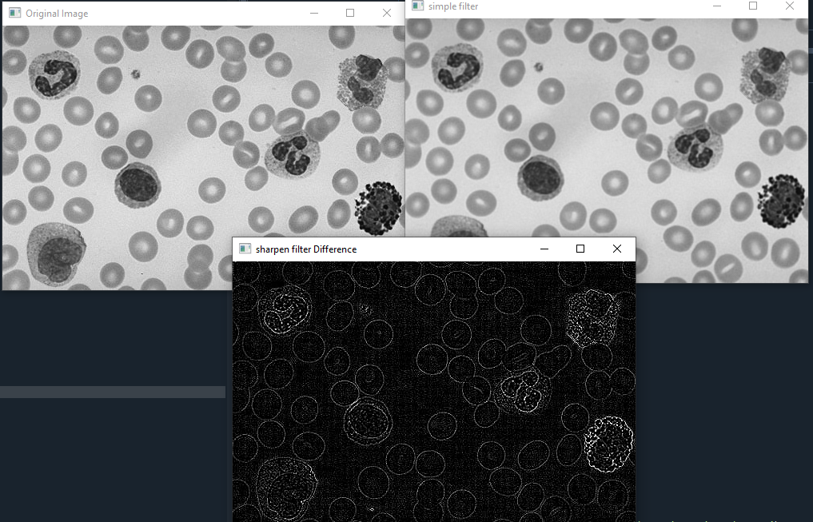

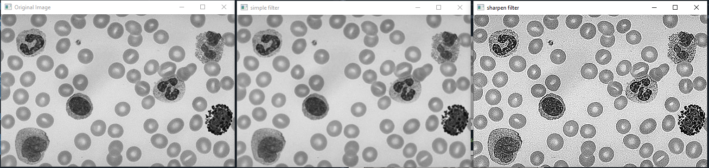

## Object Detection using matching template

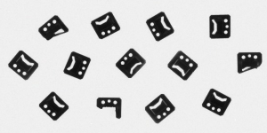

Lets say we want to find a matching object within a image. Example that we will be using is the below.

The Image that we are trying to detect 


### **Cross-Correlation**

```python
# -*- coding: utf-8 -*-
"""
Created on Mon Dec 16 14:18:03 2024

@author: STORM
"""

import cv2
import numpy as np

def cross_correlation(image, template):
    # Get dimensions
    img_h, img_w = image.shape
    temp_h, temp_w = template.shape
    
    # Output result matrix
    result = np.zeros((img_h - temp_h + 1, img_w - temp_w + 1))

    # Slide the template across the image
    for y in range(result.shape[0]):
        for x in range(result.shape[1]):
            # Extract region of interest (ROI)
            roi = image[y:y+temp_h, x:x+temp_w]
            
            # Cross-Correlation: Sum of element-wise multiplication
            correlation = np.sum(roi * template)
            result[y, x] = correlation

    return result

# Load the image and template in grayscale
image = cv2.imread('C:/Users/STORM/Desktop/images/mounts.png', cv2.IMREAD_GRAYSCALE) 
template = cv2.imread('C:/Users/STORM/Desktop/images/mount2.png', cv2.IMREAD_GRAYSCALE)
# Call the custom function
result = cross_correlation(image, template)

# Normalize result for visualization
result_norm = cv2.normalize(result, None, 0, 255, cv2.NORM_MINMAX).astype(np.uint8)

# Display the result
cv2.imshow("Cross-Correlation Result", result_norm)
cv2.waitKey(0)
cv2.destroyAllWindows()
```

The simplest form or matching templates is the Cross Correlation method. Example of the implementation behind it is with the below formula:


When we run the code below we can see in white the values that the method “calculated as closely matching

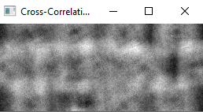

The fundamental method of calculating the image correlation is so called *cross-correlation*, which essentially is a simple sum of pairwise multiplications of corresponding pixel values of the images.

Though we may notice that the correlation value indeed seems to reflect the similarity of the images being compared, cross-correlation method is far from being robust. **Its main drawback is that it is biased by changes in global brightness of the images - brightening of an image may sky-rocket its cross-correlation with another image, even if the second image is not at all similar.**

The values of each pixel after the sum:

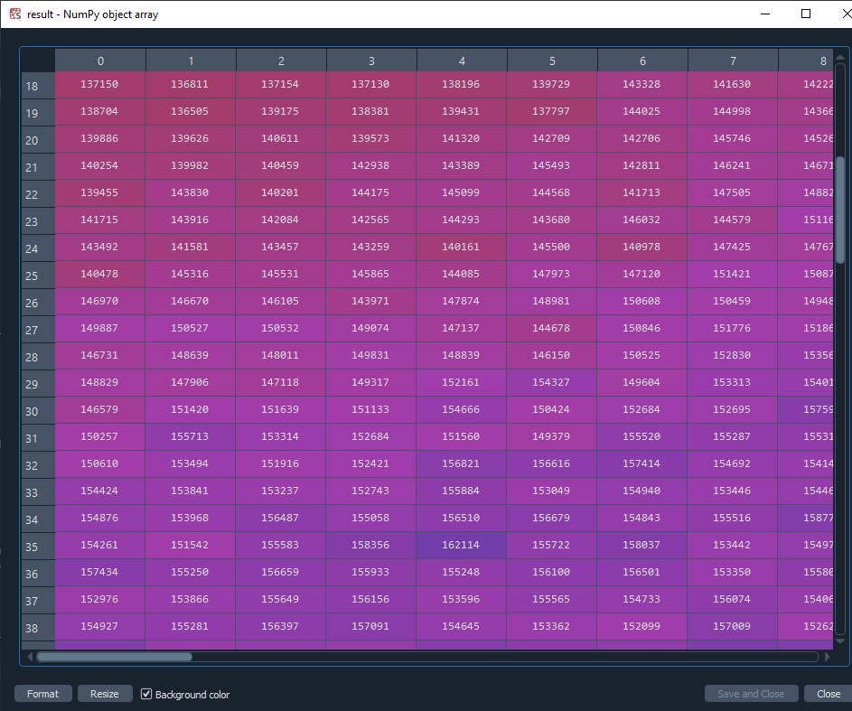

*Normalized cross-correlation* is an enhanced version of the classic *cross-correlation* method that introduces two improvements over the original one:

### **Normalized Cross-Correlation**

```python
# -*- coding: utf-8 -*-
"""
Created on Mon Dec 16 14:37:23 2024

@author: STORM
"""

import cv2
import numpy as np

def normalized_cross_correlation(image, template):
    # Get dimensions
    img_h, img_w = image.shape
    temp_h, temp_w = template.shape

    # Compute template mean and standard deviation
    template_mean = np.mean(template)
    template_std = np.std(template)

    # Ensure template_std is not zero (avoid division by zero)
    if template_std == 0:
        raise ValueError("Standard deviation of template is zero, cannot normalize.")

    # Output result matrix
    result = np.zeros((img_h - temp_h + 1, img_w - temp_w + 1))

    # Slide the template across the image
    for y in range(result.shape[0]):
        for x in range(result.shape[1]):
            # Extract region of interest (ROI)
            roi = image[y:y+temp_h, x:x+temp_w]

            # Calculate mean and std of the current ROI
            roi_mean = np.mean(roi)
            roi_std = np.std(roi)

            # Ensure roi_std is not zero
            if roi_std == 0:
                result[y, x] = 0  # Avoid division by zero
                continue

            # Compute NCC using the formula
            ncc = np.sum(((roi - roi_mean) * (template - template_mean)) / (roi_std * template_std))
            result[y, x] = ncc

    return result

# Load the image and template in grayscale
image = cv2.imread('C:/Users/STORM/Desktop/images/mounts.png', cv2.IMREAD_GRAYSCALE) 
template = cv2.imread('C:/Users/STORM/Desktop/images/mount2.png', cv2.IMREAD_GRAYSCALE)

# Call the custom NCC function
ncc_result = normalized_cross_correlation(image, template)

# Normalize result for visualization
ncc_result_norm = cv2.normalize(ncc_result, None, 0, 255, cv2.NORM_MINMAX).astype(np.uint8)

# Display the result
cv2.imshow("NCC Result", ncc_result_norm)
cv2.waitKey(0)
cv2.destroyAllWindows()

```

The improved version of this method would be the 

Represented by this formula:


Using the below:

With this formula we get an even closer match as seen below

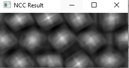

- The results are invariant to the global brightness changes, i.e. consistent brightening or darkening of either image has no effect on the result (this is accomplished by subtracting the mean image brightness from each pixel value).
- The final correlation value is scaled to [-1, 1] range, so that NCC of two identical images equals 1.0, while NCC of an image and its negation equals -1.0.

If we compare the array of the resulting image we can see the diff between the cc and ncc one

### **Template Correlation Image**

*Template Matching* is a high-level machine vision technique that identifies the parts on an image that match a predefined template. Advanced template matching algorithms allow to find occurrences of the template regardless of their orientation and local brightness.

Template Matching techniques are flexible and relatively straightforward to use, which makes them one of the most popular methods of object localization. Their applicability is limited mostly by the available computational power, as identification of big and complex templates can be time-consuming.

```python
import cv2
import numpy as np
from matplotlib import pyplot as plt

img_rgb = cv2.imread('C:/Users/STORM/Desktop/images/mounts.png')
img_gray = cv2.cvtColor(img_rgb, cv2.COLOR_BGR2GRAY)
template = cv2.imread('C:/Users/STORM/Desktop/images/mount2.png', 0)
h, w = template.shape[::]

res = cv2.matchTemplate(img_gray, template, cv2.TM_CCOEFF_NORMED)
plt.imshow(res, cmap='gray')

threshold = 0.8

loc = np.where( res >= threshold)  
for pt in zip(*loc[::-1]):  
    cv2.rectangle(img_rgb, pt, (pt[0] + w, pt[1] + h), (0, 0, 255), 1)

cv2.imshow("Matched image", img_rgb)
cv2.waitKey()
cv2.destroyAllWindows()
```

The TM_CCOEFF_NORMED variable represents the mask that will be used for the template matching method. What it actually represents is a mathematical formula as seen below:

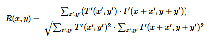

This formula more accurately matches the template to the image.

$$
R(x,y)= 
∑x′,y′(T′(x′,y′)⋅I′(x+x′,y+y′))/√∑x′,y′T′(x′,y′)2⋅∑x′,y′I′(x+x′,y+y′)2
$$

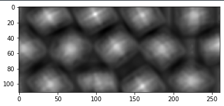

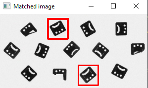

Write other types of object detections using templates

https://docs.fab-image.com/5.0/fil/machine_vision_guide/TemplateMatching.html

https://stackoverflow.com/questions/26508581/matching-small-grayscale-images

### NCC

### CC

### TOM

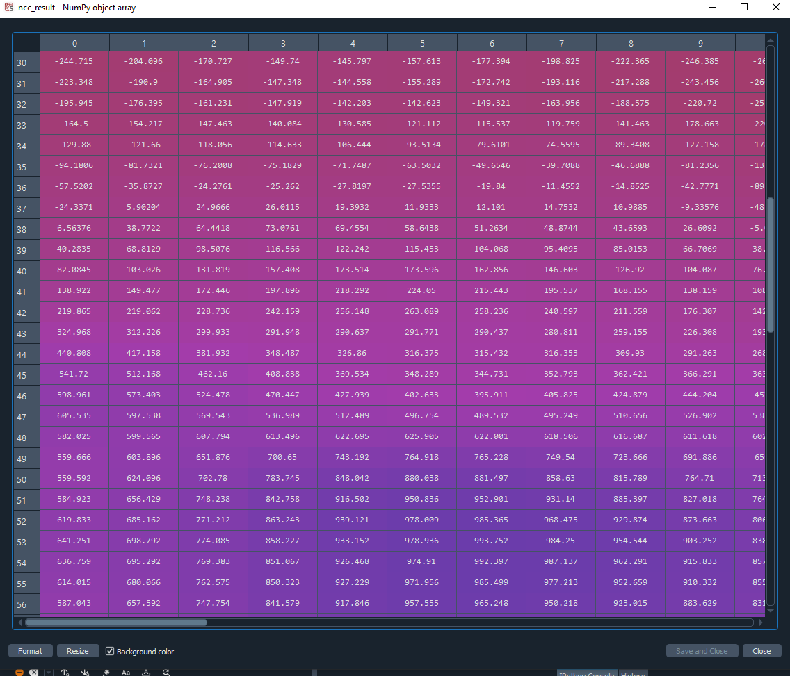


## JPEG

[https://www.youtube.com/watch?v=Kv1Hiv3ox8I](https://www.youtube.com/watch?v=Kv1Hiv3ox8I)

[https://www.geeksforgeeks.org/process-of-jpeg-data-compression/](https://www.geeksforgeeks.org/process-of-jpeg-data-compression/)

[**JPEG**](https://www.geeksforgeeks.org/image-formats/) stands for Joint Photographic Experts Group. We perform such type of compression to reduce the size of the file without damaging its quality. By reducing the size we can store it in a huge amount which was not possible earlier. Reducing the size of images will also improve the efficiency of the system as it will give less load on it.

**Process Of JPEG Compression :**

Firstly, we convert the R, G, B color format to Y, Cb, Cr format. Some colors are more sensitive to human eyes and thus are high-frequency colors. Some colors of chromium compounds like Cb and Cr are less sensitive to human eyes thus can be ignored. Then we reduce the size of pixels in downsampling. We divide our image into 8*8 pixels and perform forward DCT(Direct Cosine Transformation). Then we perform quantization using quantum tables and we compress our data using various encoding methods like run-length encoding and Huffman encoding.

In the second stage, we decompress our data, It involves decoding where we decode our data, and we again de-quantize our data by referring to the quantization table. Then we perform Inverse DCT and upsampling to convert it into original pixels and finally, color transformation takes place to convert the image into its original color format.

1. Color Space Conversion
2. Chrominance Downsampling
3. Discrete Cosine Transform
4. Quantization
5. Run Length and Huffman Encoding

steps

1. Split image into 8 by 8 non overlappping blocks
2. compute the DCT for each block
3. quanitize DCT coeffictients according to psycovisually-tunes tables
4. run-lenght endoding and Huffman coding]


### **What is the best lossless compression algorithm?**

The best lossless compression algorithm may not be the same in every case. One of the most popular is Run-Length Encoding (RLE), which encodes data into smaller bytes by identifying repeated information. This complex approach allows compression to reconstruct the data, so it appears exactly the way it did beforehand.